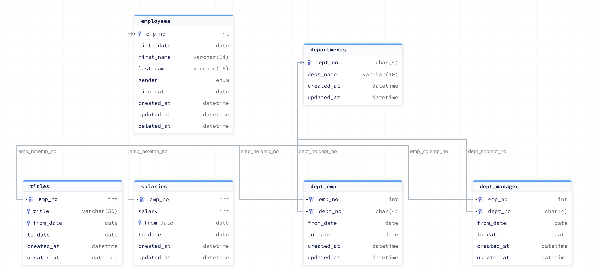

# compare-go-orm
Try multiple Go ORM and compare features

## Overview
This will help you when you want to compare ORM in go.
I made the following 3 ORM sample codes.

- [gorm](https://github.com/go-gorm/gorm)
- [ent](https://github.com/ent/ent)
- [sqlboiler](https://github.com/volatiletech/sqlboiler)

Each ORM sample codes implement a common [interface](https://github.com/sonkibon/compare-go-orm/blob/main/repository/employee.go).
The database schema is based on this [repository](https://github.com/datacharmer/test_db).

If you want to see how the implementation differs for each ORM, check out the sample codes.

- [gorm](https://github.com/sonkibon/compare-go-orm/blob/main/gorm/infrastructure/employee.go)
- [ent](https://github.com/sonkibon/compare-go-orm/blob/main/ent/infrastructure/employee.go)
- [sqlboiler](https://github.com/sonkibon/compare-go-orm/blob/main/sqlboiler/infrastructure/employee.go)

If you want to generate code and run the code, check the README for each ORM.

- [gorm](https://github.com/sonkibon/compare-go-orm/blob/main/gorm/README.md)
- [ent](https://github.com/sonkibon/compare-go-orm/blob/main/ent/README.md)
- [sqlboiler](https://github.com/sonkibon/compare-go-orm/blob/main/sqlboiler/README.md)
